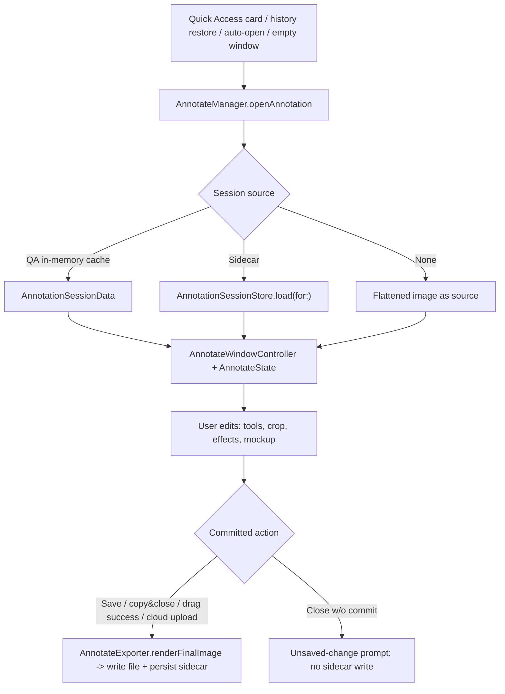
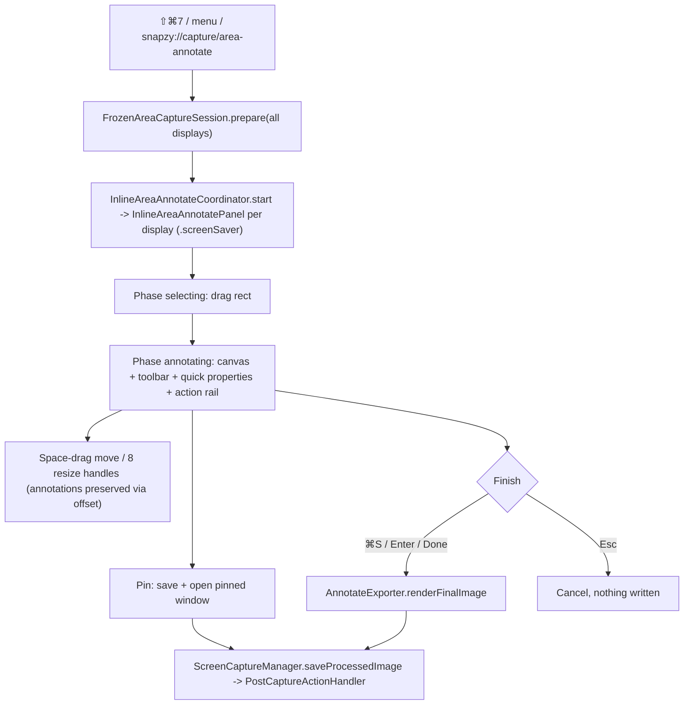

# Annotate Editor & Capture Markup

Snapzy's annotation subsystem: the full Annotate editor window (hybrid AppKit shell + SwiftUI chrome + AppKit drawing canvas) and the inline area-annotate overlay (Capture Markup) that reuses the same engine before save. Both render final output through one exporter path.

## Architecture

- `Snapzy/Features/Annotate/AnnotateManager.swift` — singleton window registry; session cache keyed by `QuickAccessItem.id`; activation policy bump to `.regular` on open; `openAnnotation(for:)` (QA item) / `openAnnotation(url:sessionData:)` / `openEmptyAnnotation()`.
- `Snapzy/Features/Annotate/Managers/AnnotateWindowController.swift` — per-window controller, owns save/copy/close notifications.
- `Snapzy/Features/Annotate/Managers/AnnotateWindow.swift` — `NSWindow` subclass; intercepts ⌘+scroll zoom, trackpad magnify, Space key (pan mode via `annotateSpaceDown/Up` notifications), drag events; level floats while key (`activeEditorLevel`) and restores `restingLevel` on resign; pin sets resting level `.floating`. `AnnotateWindowEventRouter` scopes these input notifications (and cloud-upload actions) to the originating window, so each full editor keeps isolated viewport and UI state.
- `Snapzy/Features/Annotate/AnnotateState.swift` — central `ObservableObject` (~4.8k lines): annotations, tools, undo/redo, zoom/pan, canvas effects, crop, cutout, mockup, combine, cloud state.
- Layout (`AnnotateMainView`): `AnnotateToolbarView` → `AnnotateQuickPropertiesBar` → `HStack(AnnotateSidebarView 240pt | AnnotateCanvasView)` → `AnnotateBottomBarView`.
- Rendering: `DrawingCanvasNSView` (AppKit event container) + 7 stacked `CanvasLayerView`s composited by CoreAnimation — spotlight overlay → selection underlay → static-below → dragged → static-above → gesture preview → selection chrome. Static layers redraw only when invalidated (CA reuses their backing store), so per-frame cost is flat in annotation count and colors always render through the standard pipeline (no offscreen bitmap color management). Deterministic export via `AnnotateExporter.renderFinalImage` (mockup: `renderMockupFlatImage` off-main + `compositeMockupImage` on main — `ImageRenderer` is main-only).
- Gesture handling: drag/resize/draw gestures mutate gesture-local `AnnotationItem` copies (no `@Published` churn) and commit once on `mouseUp` via the regular `AnnotateState` update methods + one undo checkpoint; the manipulated item draws in the dragged layer between the static layers (exact z-order). Invalidation: content publishers (`$annotations`, `$sourceImage`, …) redraw all layers; selection changes and zoom redraw only the cheap selection layers. Full redraw path culls items outside the dirty rect.
- Render z-order (`renderOrdered` in `AnnotateAnnotationItem.swift`, shared by canvas + exporter + hit-testing): embedded images bottom → blur/redact → markup (shapes, arrows, text, counters, …) top. Stable within tiers; model array order unchanged, so blur never covers shapes in canvas or export.
- `AnnotateState.EditorMode`: `.annotate` (flat editing), `.mockup` (3D transforms), `.preview` (hides editing UI).

### Save-and-close ordering (perf)

⌘S/close-with-save is ordered so the Quick Access card reappears with an unblocked main thread:

1. `markAsSaved` + session cache + `state.makeRenderSnapshot()` — freezes every render input into a value-type `AnnotateRenderSnapshot` (warms lazy embedded-CGImage caches, pre-resolves main-bound wallpaper/blur images).
2. Instant anti-flash thumbnail: `cacheDisplay` of the canvas region (`DrawingCanvasNSView`, no toolbar/sidebar chrome) downscaled to 200px — set on the card immediately; the pin window is NOT updated with it.
3. `forceClose()` — window hidden + closed, card reappear commits.
4. `Task.detached`: off-main `renderFinalImage(snapshot:)` → off-main 200px downscale → main push of the authoritative thumbnail + pin full-res update + `markCloudStale` (guarded by a per-item save generation, last-save-wins) → `saveToFileOffMain` (encode off-main; scoped write + history on main) → sidecar persist off-main (`AnnotationSessionStore.persistOffMain`) → clipboard re-copy off-main (`ClipboardHelper.copyImageOffMain`, serialized).

The `.accessory` activation-policy revert is deferred to a later runloop turn (shared by Annotate/VideoEditor) so it never stalls the reappear. Signposts (`perf.signposts` default + Instruments `com.snapzy.perf`): `AnnotateReturn`, `instantThumbCapture`, `windowClose`, `render`, `thumbnailScale`. Perf evidence: `plans/260718-1956-quick-access-annotate-return-perf/reports/`.

## Tools & Shortcuts

`AnnotationToolType` (`Models/AnnotateAnnotationToolType.swift`) — 15 tools, single-key defaults, all rebindable via `AnnotateShortcutManager`:

| Tool | Key | Tool | Key | Tool | Key |
| --- | --- | --- | --- | --- | --- |
| selection | `v` | arrow | `a` | blur | `b` |
| crop | `c` | line | `l` | spotlight | `s` |
| rectangle | `r` | text | `t` | counter | `n` |
| filledRectangle | `f` | highlighter | `h` | watermark | `w` |
| oval | `o` | pencil | `p` | mockup | `m` |

- `drawableTools` shared with inline overlay so surfaces stay in sync; `supportsQuickPropertiesBar` false for selection/crop/mockup.
- While a drawing tool is active, a drag can start over an existing annotation to create a new item; use Selection to move or resize existing annotations.
- In the full annotation window, `⌘C` copies selected annotation items to the session-local editable clipboard, `⌘V` pastes independent items centered under the canvas cursor when available, and `⌘D` duplicates the selection. Repeated pastes add a predictable 10pt diagonal offset; duplicated items use the same fixed offset (all clamped to the editable canvas when possible). Each operation is one annotation undo/redo checkpoint. Text editors and input fields keep native copy/paste behavior, and the inline overlay keeps `⌘C` for copying the rendered image.
- Annotate sessions — both the inline screenshot overlay and full editor windows (`AnnotateWindowController`) — start with `annotate.defaultTool` (selection by default). When `annotate.rememberLastTool` is enabled, explicit toolbar or keyboard tool choices on either surface are stored in `annotate.lastUsedTool` and take precedence in the next session. Combine-mode activation and annotation-selection tool switches still force Selection and are never remembered.
- Quick properties bar (`AnnotateQuickPropertiesBar`): context controls — primary color, text background, blur type, arrow style/bend/heads, watermark text/style/opacity/rotation, stroke width, font size, corner radius, line style, highlighter text snapping. Modes `hidden / toolDefaults / selectedItem`.
- Line style (`LineDashStyle` = solid / dashed / dotted): applies to rectangle, filledRectangle stroke, oval, line, and classic arrows (shaft dashed, heads stay solid; tapered/outlined arrows are filled silhouettes and don't qualify). Dash lengths scale with stroke width; dotted = zero-length segments + round caps. Persisted per tool and in session sidecars as optional `lineStyle` raw strings (default `.solid`, no schema bump).
- Hold Shift while drawing Rectangle, Filled Rectangle, or Oval to lock equal width and height; Line and Straight Arrow snap to 45-degree increments, while Curved Arrow remains unconstrained.
- "Sync tool defaults" pref (`annotate.quickPropertiesSyncEnabled`, default on): tool defaults (color, stroke width, font size, corner radius, watermark opacity/rotation) shared across compatible tools via `SharedAnnotationParameterDefaults` (`annotate.parameterDefaults.v1`) when nothing selected; per-tool defaults stay independent when off (`annotate.toolParameterDefaults.v1`). Selected-item numeric edits stay local; slider drags grouped into one undo checkpoint.
- Favorite colors capped at 4 per role (`AnnotateColorPaletteStore.maximumFavoriteColorCount`; custom colors cap 24).

## Arrows

- `ArrowGeometry` (`Models/AnnotateAnnotationItem.swift`): `ArrowStyle` = straight / curvedRight / curvedLeft; `ArrowType` = classic / tapered / outlined.
- Double-sided heads: `ArrowEndpointStyle` `startHead` / `endHead` (commit `b299bad`); applies to `.classic` — tapered/outlined bake the head into the body.
- Figma-style endpoint dragging for arrows + lines (commit `22766cb`).

## Blur / Pixelate

- `BlurType` — 8 effects: pixelated, gaussian, hexagonal, crystallized, pointillism, halftone, tape, washi.
- `AnnotateBlurEffectRenderer` — CoreImage/Metal rendering with quality tiers.
- `AnnotateBlurCacheManager` — non-blocking preview cache: miss draws lightweight placeholder, background work coalesced per annotation. Budgets: 1.6 MP per blur (`maxCachedPixelsPerBlur = 1_600_000`), 8 MP total (`maxTotalCachedPixels = 8_000_000`). Save/copy/share/export bypass the cache and render deterministically through `AnnotateExporter`.

## Spotlight

- `AnnotateSpotlightCompositor` — dim-with-holes compositing via transparency layers + clear blend mode; overlapping regions union.
- Single global dim opacity clamped 0.1–0.9 (default 0.5), sourced from first committed region.

## Counter, Stamp, Highlighter, Watermark, Crop

- Counter: click-to-place, auto-increment per placement (from a configurable start value); diameter derived from stroke width. Numbering format (numeric / alphabetic / Roman numerals) is chosen via the quick properties bar and applies to new counters, or to the currently selected one.
- Stamp: click-to-place circular badge, same sizing as Counter (shares its diameter/stroke-width control). Five fixed icons -- check, cross, warning, bug, CRO (target) -- each with its own fixed badge color (not user-recolorable), so the same icon always reads the same meaning at a glance. Icon is chosen via the quick properties bar for both new and already-placed stamps.
- Highlighter: freehand with auto-straighten for near-straight strokes.
- Highlighter text snapping: while dragging, the stroke snaps to detected text lines — centered on each line, height `1.15 ×` the median detected line height of the drag (uniform across a multi-line sweep, carried by `strokeWidth` since highlights render at 3× stroke width), ends snapped to word edges. A drag across several lines of one block emits one bar per line with text-selection semantics in a single undo step. `AnnotateTextSnapDetector` (one Vision pass per image, computed when the highlighter is first activated, cached on `AnnotateState.textLineProfile`) feeds the pure math in `AnnotateTextSnapping`. Toggle in the highlighter's quick-properties bar (defaults context only — a committed highlight's geometry is fixed) or Settings → Annotate (`annotate.highlighterTextSnappingEnabled`, default on); hold ⌘ mid-drag to bypass. Falls back to freehand when no text is near the drag, the drag is vertical/short, or the path leaves the text band.
- Watermark: `WatermarkStyle` single / diagonal / tiled; editable text, opacity, size, rotation, color.
- Crop: shrink AND expand canvas (drag handles outside source creates annotatable empty canvas, included in export). `CropAspectRatio` presets Free/1:1/4:3/3:2/16:9/21:9 + portrait toggle. Esc cancels, Return/⌘S commits; while cropping, `CropToolbarView` replaces the bottom-bar right side.
- Crop edge snapping: while dragging resize handles in Free mode, edges snap to detected content borders (`CropContentAnalyzer` edge profile, computed once per image on crop entry). Toggle in `CropToolbarView` or Settings → Annotate (`annotate.cropSnapToEdgesEnabled`, default on); hold ⌘ mid-drag to temporarily bypass. Snapping skips fixed-aspect/Shift-locked resizes and body moves.
- Crop auto-crop to content: `A` (or the toolbar button) tightens the current crop rect to detected content borders; falls back to Vision subject-mask bounds on macOS 14+ when edge analysis finds nothing (`ForegroundCutoutService.extractForegroundResult` reuse). Toasts when nothing is detected; Esc still restores the pre-crop rect. A crop rect expanded beyond the source image tightens to the image bounds on the out-of-bounds side(s).

## Undo/Redo

- `UndoEntry` = `.annotations(AnnotationSnapshot)` | `.rotation(RotationSnapshot)` — rotation undo never disturbs the annotation path.
- Annotation snapshots include selection and embedded-layer metadata so object paste/duplicate undo is atomic and redo reselects the newly created items.
- Text-edit commits as one transaction; quick-properties slider gestures scoped to a single checkpoint (`quickPropertiesGestureUndoSnapshot`).

## Zoom & Pan

- Range 0.25–16x: `minimumZoomLevel 0.25`, default max 4.0, `hardMaximumZoomLevel 16.0`; `effectiveMaximumZoomLevel` grows to `1/fitScale` for very long captures.
- Input: pinch magnification, ⌘+scroll, Space+drag pan, ⌘=/⌘−/⌘0 (fit); zoom picker presets + `1:1` actual-pixels in bottom bar.
- Selection chrome is editor-only: resize/end-point grips stay 8pt, selection outlines stay 1pt with 4pt dashes, and freehand halos stay 4pt in screen space. Image-space draw geometry compensates for both fit scale and zoom while AppKit hit testing uses the matching canvas-local conversion; Retina backing density requires no separate multiplier.
- Annotation geometry remains in document/image coordinates. The fit-sized `DrawingCanvasNSView` is rendered through an outer SwiftUI zoom/pan transform; because that transform changes visual bounds without expanding the representable's AppKit hit frame, `CanvasInteractionProxy` covers the viewport and forwards only points within the canvas' transformed visual bounds (with a registered native inline text editor taking priority). The drawing view's normal AppKit conversion then inverts that transform before image-coordinate conversion applies the fit scale and canvas origin. Dynamic annotation hit tolerances and drag-to-create thresholds are derived from the combined fit scale × zoom scale, keeping lines, arrows, paths, handles, and small gestures visually aligned at every zoom level. Selection uses the canvas hit result directly instead of re-running the model's fixed image-space tolerance.
- Full-editor AppKit input is delivered through the per-window `AnnotateWindowEventRouter`; zoom, pan, and Space transitions update only the `AnnotateState` owned by the originating window. Session edits, viewport metrics, and undo state remain controller-local; shared shortcut, palette, and preset stores are preferences, not editor state.

## Backgrounds & Mockups

- `BackgroundStyle` (`Models/AnnotateBackgroundStyle.swift`): none / gradient (8 `GradientPreset`s) / wallpaper(URL) / blurred(URL) / solidColor. `BlurredBackgroundEffect`: soft / frosted / vivid / dim.
- `SystemWallpaperManager` (`Services/Wallpaper/`) — 12 bundled JPG wallpapers + custom wallpaper security-scoped bookmarks; thumbnail cache.
- Aspect ratio (`AspectRatioOption`: Auto/Free/1:1/4:3/3:2/16:9) + orientation toggle + 9-way `ImageAlignment`.
- Mockup mode: integrated 3D tilt — rotation X/Y/Z, perspective, shadow — via `AnnotateMockupTransformModifier` + `AnnotateMockup3DRenderer`; 8 `MockupPreset`s in `DefaultPresets.all` (flat, leftTilt, rightTilt, topView, isometricLeft, isometricRight, heroShot, dramatic); inline preset bar `MockupPresetBarInline`.
- Standalone `MockupManager` window (`Managers/AnnotateMockupManager.swift`) has no remaining callers — orphaned; mockup UX lives in editor mode.

## Remove Background (Cutout)

- Toolbar button, macOS 14+; `ForegroundCutoutService` (`Services/Media/`) runs Vision `VNGenerateForegroundInstanceMaskRequest`.
- Non-destructive overlay: original kept, cutout composited through `effectiveSourceImage`; revert restores original.
- Crop-aware auto-crop: `ForegroundAutoCropPolicy` heuristics → `ForegroundAutoCropDecision` enum; auto-crop applied only when `.suggested` and pref on; applied rect tracked (`cutoutAutoAppliedCropRect`) for exact revert on toggle-off.
- Global pref `backgroundCutout.autoCropEnabled` (default true), shared with capture-time cutout flow.

## Auto Sensitive-Data Redaction

- `AnnotateSensitiveRedactionService` — 100% on-device: Vision OCR → `AnnotateSensitiveDataDetector` deterministic matching. Detects emails/phone numbers/URLs (NSDataDetector), credit cards (Luhn + issuer prefixes + contextual multi-line parsing for number/expiry/cardholder rows), credential key=value pairs, Bearer/AWS/GitHub/Slack/Stripe/OpenAI/JWT tokens.
- Creates editable pixelated blur annotations in one undo checkpoint; recognized text never persisted; pixels bake only at export.
- Triggered from the blur tool's quick-properties bar; action shortcut `.autoRedactSensitiveData` ships unbound (`AnnotateShortcutManager`).

## Extract Text

In the normal Annotate mode, right-click the underlying image and choose **Extract Text**.
Snapzy runs the configured OCR provider from Capture → OCR, copies the recognized text to
the general pasteboard, and reports the result through the existing OCR notification/toast
flow. The action does not modify annotations, crop state, or saved files. It is disabled in
Combine, Mockup, and Preview modes because those modes do not identify one unambiguous OCR
source image.

## Combine Images

- `CombineImagesCoordinator` (`Features/Annotate/CombineImagesCoordinator.swift`) — picker entry from status bar menu or `snapzy://open/combine?file=...`; requires ≥2 images.
- Modes: autoStitch / freeCanvas; direction smart / horizontal / vertical; edge snapping; session persisted as `PersistedCombineSession` inside the sidecar manifest.

## Session Sidecars

- `AnnotationSessionStore` root: `~/Library/Application Support/Snapzy/AnnotationSessions/<SHA256(normalizedPath)>/`.
- Package: `manifest.json` (`PersistedAnnotationSession`, schemaVersion 1, `PersistedFileSignature` = size + modifiedAt + extension) + `original.bin` + optional `cutout.png` + `assets/` (embedded images). Signature mismatch (replaced file at same path) → sidecar ignored, never restores annotations onto wrong pixels.
- The manifest also carries `sourceLogicalSize` — the authoring-time point-space size of the source image, i.e. the coordinate space annotations live in. Session restores apply it verbatim (`AnnotateWindowController.restoredSessionImage`), so native-density (1×) captures reopen with matching annotation positions on any display arrangement; sidecars written before the field existed fall back to the legacy main-screen scale heuristic. Optional key, schemaVersion stays 1.
- File opens without a sidecar (`AnnotateState.loadImageWithCorrectScale`) derive density from the file's own DPI metadata (`fileDensityScaleFactor`, DPI ÷ 72 — Snapzy writes `scale × 72` on save); only files without usable DPI (e.g. WebP) fall back to the legacy main-screen heuristic.
- Commit-based writes only: save, save-and-close, copy&close, successful drag-to-app, cloud upload/re-upload, inline annotate finish, default-preset auto-apply. NO draft autosave; unsaved windows keep the normal unsaved-change prompt.
- Restore order: QuickAccess in-memory session cache → sidecar → flattened file.
- Cleanup paths: QA delete, Annotate delete-image, history delete, clear-history, retention sweep (incl. orphan sidecars), move-on-save (temp→export moves sidecar to new path hash).

## Drag-to-App

- `AnnotateDragHandleView` + `DragHandleNSView`: lazy `NSFilePromiseProvider` (`AnnotateDragFilePromiseProvider`) + guaranteed rendered file-URL fallback staged under `Captures/AnnotateDrag/` so file-url-only targets accept the first drag.
- `DragFallbackSignature` invalidates/renders the staged fallback when editor state changes.
- Completion policy: `annotate.closeAfterDrag` (default true — saves edits, dismisses QA card) and `annotate.bringForwardAfterDrag` (default false — reactivate preserved editor).

## Bottom Bar

- Left: zoom picker + mode segmented toggle (annotate/mockup/preview).
- Center: drag handle (compacts when tight).
- Right: new window, share (`NSSharingServicePicker`), cloud upload, pin (⌃⌘P), copy&close (⌘⇧C), delete (confirm; clears history record + sidecar + QA card, trashes file).
- Cloud button gated by `CloudManager.shared.isConfigured && QuickAccessActionConfigurationStore.shared.isEnabled(.uploadToCloud)`; ⌘U posts `annotateCloudUpload`; overwrite confirmation when item has a `cloudKey` and is stale. Note: commit `dd4ccd5` removed only the after-capture auto-upload preference — manual uploads here stay.
- Edits after upload mark item cloud-stale (`isCloudStale`) until re-upload clears it.

## Rotation & Canvas Presets

- Rotate 90° left/right from toolbar; dedicated `RotationSnapshot` undo entries.
- `AnnotateCanvasPresetStore` (`annotate.canvasPresets.v1`): background style, blur effect, spacing, shadow, corner radius, aspect ratio + orientation. One preset can be default (`annotate.defaultCanvasPresetId.v1`).
- Default preset auto-applies to new screenshots during post-capture via `ScreenshotPresetAutoApplier` — lightweight `AnnotateExporter.renderCanvasEffects` without constructing full `AnnotateState`, returns editable session data. Inline area annotate does NOT auto-apply.

## Inline Area Annotate (Capture Markup, ⇧⌘7)

Select region and annotate before saving, inside per-display overlays sharing one desktop coordinate space. Same engine/tools as the full editor minus crop and mockup.

### Inline shortcuts

| Key | Action | Key | Action |
| --- | --- | --- | --- |
| `Enter` / `⌘S` | Finish & save | `B` | Blur |
| `⌘C` | Copy rendered image | `S` | Spotlight |
| `Esc` | Cancel | `N` | Counter |
| `Space` (hold) | Move selection | `W` | Watermark |
| `V`/`R`/`F`/`O` | Selection / Rect / Filled / Oval | `P` | Pencil |
| `A`/`L`/`T`/`H` | Arrow / Line / Text / Highlighter | | |

- `InlineAreaAnnotateSession` owns the selecting→annotating state machine; panels at `.screenSaver` level with `canJoinAllSpaces` work across Spaces.
- Move/resize refreshes the cropped source via `replaceSourceImagePreservingAnnotations(_:annotationOffset:)`; cross-display crops use `FrozenAreaCaptureSession.cropCompositeImage`.
- Action rail: Pin-to-Screen / Cancel / Done (prominent) / Copy. Pin runs the normal post-capture pipeline once, then opens the saved image in a pin window.
- No crop, no mockup, no canvas-preset auto-apply.

## Related docs

- [CAPTURE.md](CAPTURE.md) — capture flows feeding the editors
- [SCROLLING_CAPTURE.md](SCROLLING_CAPTURE.md) — long captures (dynamic zoom max)
- [QUICK_ACCESS.md](QUICK_ACCESS.md) — card edit action, pin windows, session cache
- [HISTORY.md](HISTORY.md) — restore flow and sidecar lifecycle
- [POST_CAPTURE.md](POST_CAPTURE.md) — routing incl. preset auto-apply
- [CLOUD.md](CLOUD.md) — manual upload + stale/re-upload semantics
- [PREFERENCES.md](PREFERENCES.md) — Annotate settings keys
- [SHORTCUTS.md](SHORTCUTS.md) — global shortcut registry
- [LOCALIZATION.md](LOCALIZATION.md) — L10n ownership
