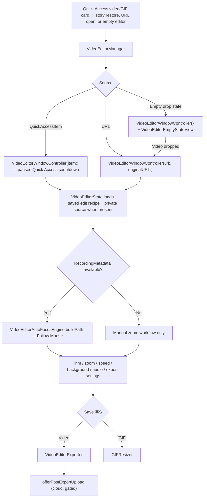

# Video Editor

This doc covers the video editor in `Snapzy/Features/VideoEditor/`: windowing, the clip sequence (split / delete / reorder / trim / insert), zoom segments, Follow Mouse (Smart Camera), speed (timelapse) segments, background/padding, audio mixing, export, GIF resizing, and undo/redo. How recordings and their mouse/audio metadata are produced lives in [`RECORDING.md`](RECORDING.md).

## Timeline Coordinate System

The timeline is an **ordered sequence of clips** laid shoulder to shoulder. Each clip owns
a fixed structural slot, while its active in/out range determines what plays. The editor
uses three related time bases:

- **Structural timeline time** — `Σ clip.slotDuration`. The ruler, scrubber, viewport,
  clip strip, playhead, and effect tracks use this stable axis. Trimmed-out edge footage
  remains visible in its slot and is inactive/dimmed; neighboring clips do not ripple when
  a trim handle moves.
- **Playable sequence time** — `Σ clip.duration`. Active clip material is packed here for
  preview playback, speed lookup, and composition export; inactive trim slots are skipped.
- **Output time** — playable sequence time with speed segments applied.

`TimelineSequenceMap` converts playable sequence time to/from output time
(`toOutput` / `toSequence` / `rate(atSequence:)`).
`TimelineSequence` (`Models/VideoEditorTimelineClip.swift`) lays clips out and maps sequence
time ↔ source time. `layout(_:)` is the structural layout and `playableLayout(_:)` is the
compact playback/export layout.

Zoom and speed are authored directly in **structural timeline time**, independently from
the source time of any clip. Their blocks therefore stay at the position the user chose
when clips are cut, swapped, inserted, or reordered. Only playback/export performs a
structural → playable projection (`TimelineSequence.project(timelineRange:from:to:)`) to
remove inactive trim slots. An effect spanning a trim gap applies to every active piece on
both sides; an effect entirely inside inactive footage has no rendered material.

With one untouched primary clip (`!state.hasSequenceEdits`), all three axes equal source time,
so behavior matches the pre-sequence editor exactly.

## Entry and Windowing



- `VideoEditorManager` (singleton) tracks windows per Quick Access item id, per URL, and one empty editor; opening an existing item/URL reuses its window.
- Activation policy: switches the app to `.regular` (Dock + ⌘Tab) while an editor is open, reverts to accessory when the last editor/Annotate window closes.
- `VideoEditorWindowController` (`Managers/VideoEditorWindowController.swift`) creates a 1200×800 `VideoEditorWindow` centered on the main screen. Opening from a Quick Access item pauses that item's countdown (`QuickAccessManager.pauseCountdownForEditingItem`) and resumes on close.
- `windowShouldClose` routes through an unsaved-changes alert (Save / Don't Save / Cancel) driven by `state.hasUnsavedChanges`, mirrored to `window.isDocumentEdited`.

## State and Playback

- `VideoEditorState` (`VideoEditorState.swift`) is the central model: asset, trim range, zoom/speed segments, background, export settings, undo stacks. `VideoEditorPlaybackState` holds playhead/playing/scrubbing.
- Playback position comes from an `AVPlayer` periodic time observer at 1/30 s; an item-end observer loops playback within the trim range.
- When a Snapzy recording has an editor audio source sidecar, the state's asset URL is swapped to the multitrack sidecar (`editorAssetURL(for:metadata:)`) while save/replace keeps targeting the user-facing compatible file.

## Reopen and Continue Editing

- Every successful in-place Video Editor Save persists a versioned edit recipe in `Application Support/Snapzy/VideoEditorSessions/`. The recipe includes the ordered cut/trim timeline, zoom blocks, speed blocks, background, audio/export settings, and recording metadata.
- The first commit also preserves a private source snapshot captured before rendering. When the file is reopened from Quick Access, History, or a direct URL, `VideoEditorState` loads that snapshot as its editing asset while keeping the current rendered file as the replacement target. A later Save therefore applies the recipe to the original source again instead of applying edits to an already-rendered export.
- The sidecar is keyed by the current media path and validated against its size, modification time, and extension. A missing, invalid, or incompatible sidecar falls back to opening the flattened media as a legacy session.
- Temporary capture (`after capture → save = false`) commits the rendered file at its temp URL and keeps the recipe with the Quick Access card. Quick Access Save later promotes both the media and its editor session package to the export destination. Saved capture (`save = true`) keeps the package keyed at the existing destination.
- Session packages are removed with explicit capture deletion and are swept with history retention when their media path is no longer active; clearing all history clears the packages as well.

## Trim

- Visual timeline `Components/VideoEditorVideoTimelineView.swift` with the clip strip (`VideoEditorClipStripView`); GIF sources keep the old continuous filmstrip (`VideoEditorVideoTimelineFrameStrip`) since they have no clip sequence.
- Frame extraction uses an adaptive `FrameExtractionProfile` — 12 / 16 / 25 frames depending on track/duration, default 25 with zero tolerance.
- Thumbnails are sampled at each timeline cell's center (`(i + 0.5) / count × duration`), so cell `i` of the frame strip represents the time window `[i/count, (i+1)/count)` of the duration and stays aligned with the ruler and playhead at every zoom level. A failed decode falls back to the neighboring slot's frame so the slot count and time mapping stay exact.
- Trim is per clip and **non-destructive**: each clip keeps `sourceDuration` for its whole backing asset, plus a fixed `slotStart`/`slotEnd`. Dragging an edge changes only the active in/out range inside that slot; the dimmed unused footage stays visible and dragging outward restores it. Minimum clip length `TimelineClip.minDuration` (0.1 s).
- `state.trimStart` / `trimEnd` are derived from the first/last primary clip. GIF keeps its own stored window and still records `EditorAction.trimStart/trimEnd`.

## The Clip Sequence

`TimelineClip` (`Models/VideoEditorTimelineClip.swift`) is one segment of the timeline: a
window onto some source asset.

```swift
enum Source { case primary; case file(url: URL) }
let sourceDuration: TimeInterval   // whole asset — the bound for re-extension
var sourceStart / sourceEnd        // in / out points
let slotStart / slotEnd            // fixed structural timeline slot
```

`state.clips` is the single source of truth, seeded on load with one primary clip spanning
the recording. It replaced the previous `CutSegment` removed-ranges + appended `MergedClip`
model. A trim now leaves the clip's structural slot in place and marks only the out-of-range
edge footage inactive, so the handles and neighboring clips stay aligned.

| Action | Trigger | Effect |
| --- | --- | --- |
| Split | `S`, timeline scissors, or clip context menu | clip under the playhead becomes two clips at that frame; both halves must clear `minDuration` |
| Delete | `⌫`, timeline trash, or context menu | clip removed, everything after it ripples left; never leaves the timeline empty |
| Move | drag a clip body past its neighbour | reorder; gaps always close, so the export can never contain black frames |
| Trim | drag a selected clip's yellow edge handle | non-destructive in/out change inside its fixed slot; unused edge footage stays visible and inactive |
| Insert | timeline `+` | `.file` clip inserted at `state.insertionIndexAtPlayhead` — on a clip boundary if the playhead sits on one, otherwise after the clip on screen |

All five are undoable: `EditorAction.addClip` / `removeClip` / `updateClip` / `moveClip` /
`splitClip`. A trim drag collapses into one entry via `beginClipTrim` / `endClipTrim`.

### UI

`Components/VideoEditorClipStripView.swift` draws one rounded block per clip with a 3 pt gap,
its own thumbnails, a yellow border plus chevron trim handles when selected, and a tint +
filename badge for inserted clips.

- Pointer-down **selects** the clip, so activation is deterministic even for clicks the
  system never reports as a drag. Travel under 6 px is a plain **click**: it parks the
  playhead where you clicked. Past that it becomes a **reorder** drag; the drop index is
  whichever clip the dragged block's centre lands on.
- While the sequence is a single clip there is nothing to reorder, so a drag on the strip
  **scrubs the playhead** instead. The ruler above remains the always-available scrub
  surface; the clip strip becomes a scrub surface as well until the first cut.
- A selected clip's chevron trim handles grab only inside their own clip — the reach
  extends inward, never across the seam into the neighbour, and a 3 px travel minimum
  keeps jittery clicks from nudging the in/out point.
- Primary-clip thumbnails are sampled from the existing `frameThumbnails` array (no
  re-extraction): the full source strip is laid out at the slot's scale then shifted left by
  `slotStart`, so each frame stays under the moment it belongs to. Dimmed leading/trailing
  regions represent inactive trim material. Inserted clips get their
  own strips from `VideoEditorClipThumbnailCache`, keyed by URL so duplicates share one.

### Preview playback

The player holds one item per *source asset*, keyed on `TimelineClip.Source` — consecutive
clips cut from the same asset share an item, so an ordinary split costs a seek, not a reload.
The structural playhead snaps across inactive trim slots; `handlePlaybackTick` folds the
active item's source time back onto the structural axis, and `advanceToClip(after:)` hands
off at each clip's active out-point and rewinds at the end.

## Timeline Zoom / Pan

- The timeline maps the full duration onto `contentWidth = viewportWidth × zoomLevel`; every child (ruler, frame strip, trim handles, zoom/speed tracks, playhead, scrub gesture) keeps its `time/duration × width` math and simply receives the scaled width.
- `VideoEditorTimelineViewport` (`Models/VideoEditorTimelineViewport.swift`) owns the zoom window: `zoomLevel` (1 = fit, cap 20× and at least 1 s visible), `scrollOffset`, and playhead-anchored zoom math. It lives on `state.timelineViewport` and is UI-only (not undoable, not persisted).
- Zoom in/out: pinch on the timeline (anchored at the playhead), ⌘+scroll wheel over the timeline (anchored at the cursor), the −/%/+ cluster in the playback controls bar's right section (`TimelineZoomControls`, tap the % to fit), or ⌘= / ⌘- / ⌘0 (fit).
- Pan: plain scroll inside the timeline — two-finger/trackpad scrolling pans 1:1 (content follows the fingers) and a mouse wheel's vertical notches scroll the timeline forward/back (wheel down reveals later content), with momentum tail events included. Coarse (non-precise) wheel deltas are amplified (`VideoEditorTimelineViewport.pan`).
- Scroll handling lives in `TimelineScrollCatcher` (`Components/VideoEditorTimelineScrollCatcher.swift`): a non-hit-testable background view running a local `NSEvent` monitor scoped to the timeline bounds. The timeline is an offset-panned container driven by `viewport.scrollOffset` (no `ScrollView`), so zoom anchoring and playhead follow write the offset directly.
- While playing, the viewport page-scrolls to keep the playhead visible (skipped while scrubbing — the user is in control).

## Zoom Segments

- `ZoomSegment` (`Models/VideoEditorZoomSegment.swift`): `duration` 0.5–30 s (default 2), `zoomLevel` 1–4x (default 2), `zoomCenter` normalized 0...1, `ZoomType.auto/.manual`, `followSpeed`, `focusMargin`. `ZoomSegment.centered(at:)` places a new segment centered on the playhead; the **Z** key adds one (`VideoEditorMainView` keyboard shortcut).
- Transitions: ease-in-out cubic (`ZoomCalculator.easeInOutCubic`), `transitionDuration` default 0.4 s clamped to 0.15–0.75 and to 45 % of the segment per edge; the editor-wide `state.zoomTransitionDuration` is user-adjustable in the right sidebar.
- `Services/VideoEditorZoomCalculator.swift` computes per-frame zoom progress/crop rects; shared by preview and the export compositor.
- UI: zoom timeline track (`VideoEditorZoomTimelineTrack` + `VideoEditorZoomBlockView`), center picker (`VideoEditorZoomCenterPicker`, with presets top-left/top-right/bottom-left/bottom-right/center), live preview overlay (`VideoEditorZoomPreviewOverlay`), settings popover (`VideoEditorZoomSettingsPopover`).
- Track interaction: a tap on a zoom block activates it for editing (selects it and opens the right sidebar), a double-tap re-opens the configuration, and a drag moves/resizes it. Hit-testing prefers a block's **true-time span** over its padded visual, so narrow stretched blocks never steal activation from a neighbour.
- The block is never resolved through a clip's source range. Reordering `[A][B]` to `[B][A]` leaves a zoom at the same structural timeline position; moving it across a seam is a continuous pointer-driven operation with no re-hosting or source-time jump. This also allows a manual zoom to cover an inserted clip.
- Preview and export project the direct timeline range onto active material only when needed. A trim gap can remove rendered frames from the range without mutating or moving the authored block.
- Tap-to-add is offered over any active video clip, including inserted clips. The placeholder is hidden over an inactive trim edge, while context-menu/drag editing can still place a range that bridges a trim gap.

## Follow Mouse (Smart Camera)

- `Services/VideoEditorAutoFocusEngine.swift` `buildPath` consumes `RecordingMetadata` (see [`RECORDING.md`](RECORDING.md)) and reconstructs a smooth camera path: dead-zone around the current center with adaptive shrink under motion, exponential smoothing, cursor-speed clamp, last-visible-position fallback when the cursor leaves the capture, resample to ≤60 Hz, all clamped to the frame.
- `AutoFocusSettings` (`Models/VideoEditorAutoFocusSettings.swift`): `followSpeed` range 0.2–1.0 (default 0.55), `focusMargin` range 0.2–0.9 (default 0.45), `defaultZoomLevel` 2.0.
- New zoom segments default to `.auto` when mouse metadata exists and the playhead is over primary material; otherwise they use `.manual`. An auto segment that crosses inserted media holds its last known center because inserted media has no recorded cursor path. Primary auto-focus samples are remapped to the current structural clip order without interpolating through unrelated source frames.

## Speed (Timelapse) Segments

- `SpeedSegment` (`Models/VideoEditorSpeedSegment.swift`): `rate` 0.25–8x (presets 0.25/0.5/1/2/4/8), min duration 0.5 s; segments cannot overlap (state-level validation).
- `TimelineSequenceMap` (`Services/VideoEditorTimelineTimeMap.swift`) is the single playable-sequence↔output time-mapping authority reused by export, preview, and the file-size estimate. Speed segments are authored in structural timeline time and projected onto active material only for playback/export, so cuts, trims, inserts, and reorder do not move the block.
- The speed track mirrors the zoom track's interaction model: one direct timeline block per segment, pointer-driven drags that remain continuous across clip seams, and tap-to-add available on every active video clip (see [Zoom Segments](#zoom-segments)).
- Export applies `scaleTimeRange` to composition video + audio tracks in reverse segment order, remaps zoom times and auto-focus keyframes into the scaled timeline, and preserves audio pitch via `audioTimePitchAlgorithm = .spectral`.
- Live preview is approximate: it drives `AVPlayer.rate` per active segment instead of rebuilding a scaled composition.
- Video only — the GIF save path does not bake timeline edits, so the speed track is hidden for GIF sources.

## Background and Padding

- `BackgroundStyle` (shared `Snapzy/Features/Annotate/Models/AnnotateBackgroundStyle.swift`): `none`, `gradient`, `wallpaper(URL)`, `blurred(URL)`, `solidColor`. Combined with padding, shadow, corner radius, alignment, and aspect controls in the left sidebar (`VideoEditorVideoBackgroundSidebarView`); background changes are undoable.

## Audio in the Editor

- Multitrack recordings load the sidecar asset (see State above). Track roles come from stored metadata keyed by `AVAssetTrack.trackID`, falling back to `ScreenRecordingManager` writer order for older metadata.
- `VideoEditorAudioTrackRole` (`Models/VideoEditorExportSettings.swift`): `mixed`, `systemAudio`, `microphone`, `additional(Int)`. Per-role volume sliders in the export settings panel; `VideoEditorAudioMixFactory.makeAudioMix` builds the role-aware `AVAudioMix` shared by preview and export, so volume changes are audible before saving.
- Recordings made before the sidecar existed contain one mixed track and expose a single volume control; separated sources cannot be recovered from them.
- Exports are re-normalized to one stereo AAC track after multitrack export (`RecordingAudioCompatibilityExporter`), so saved files stay broadly compatible.

## Export

`Services/VideoEditorExporter.swift` routes `exportTrimmed(state:to:progress:)`:

| Condition | Path |
| --- | --- |
| Zooms, background, speed segments, or a multi-clip sequence present | `exportWithZooms` — `AVMutableComposition` + custom `ZoomCompositor` (`AVVideoCompositing`, CI/Metal per-frame render) |
| `exportSettings.audioMode == .mute` (no effects) | `exportVideoOnly` |
| Otherwise | `exportStandard` |

- Composition build is one pass over `state.clips`: each clip contributes its active source window from its own asset at the running playable-sequence cursor. Trimmed-out slot edges are not exported; speed spans then scale the compact composition in place. A clip with no video track still inserts an empty range so later clips keep their playable slots.
- Audio walks the same sequence per source audio track (mic / system / …). Inserted-clip audio rides lane 0; the other lanes get `insertEmptyTimeRange` for that span so every lane stays aligned.
- Zoom segments are remapped structural timeline → playable sequence → output. Auto-focus paths separately remap source samples into the hosting primary placements; inserted clip spans hold the last camera center instead of interpolating unrelated source samples, then `scaledPath` applies speed. A zoom whose range has no active material is dropped entirely.
- Custom dimensions: `ExportDimensionPreset` + `VideoEditorExportLayout` (`Models/VideoEditorExportSettings.swift`), even-aligned pixel sizes; quality presets live in the same export settings model.
- Save flow (`VideoEditorWindowController.showSaveConfirmation`): the editor commits to the current source; it does not promote a temporary Quick Access capture.
  - Temp capture (`after capture → save = false`): export to staging, replace the existing temp URL using the same backup/swap path, refresh the linked Quick Access thumbnail, and close. The card remains available; its Save action later moves the edited file to the export destination and updates history/metadata.
  - Saved capture (`after capture → save = true`): prompt Replace Original vs Save As Copy. Replace Original commits to the existing destination using the same backup/swap path; Save As Copy opens `NSSavePanel`. Permission-denied falls back to a Save As Copy prompt.
  - In-place edits re-copy the edited recording when copy-after-capture is enabled and mark an existing linked cloud upload stale. A failed commit leaves the editor and current file in place.
  - Save as copy: `_trimmed` suffix suggestion (`generateCopyFilename`, counter on collision) + `NSSavePanel`.
- After a successful saved-file export, `offerPostExportUpload` offers a cloud upload — gated by `CloudManager.shared.isConfigured` **and** `QuickAccessActionConfigurationStore.shared.isEnabled(.uploadToCloud)`. Temporary in-place commits do not offer promotion/upload; the Quick Access card remains the owner of the later save/upload actions. Accepting an offered upload uses `CloudManager.upload`, copies the public URL to the pasteboard, and syncs the cloud URL back to the linked Quick Access item.

## GIF Editing

- GIF mode is dimension-change only — no trim, zoom, or speed; saving with unchanged dimensions shows a "no changes" alert.
- `Services/GIFResizer.swift`: ImageIO per-frame resize that preserves loop count and frame delays; `GIFMetadata` reads source properties; `VideoEditorAnimatedGIFView` renders the animated preview.
- Temporary GIFs resize into staging and replace their current Quick Access file in place; saved GIFs keep the Replace Original / Save As Copy choice. Both use the `_resized.gif` copy naming convention.

## Undo / Redo

- In-memory `undoStack`/`redoStack` of `EditorAction` (max 50) inside `VideoEditorState`; covers zoom add/remove/update, speed add/remove/update/toggle, mute, background changes, and the clip sequence (add/remove/update/move/split — which subsumes trim). Shortcuts: ⌘Z / ⇧⌘Z (toolbar buttons in `VideoEditorToolbarView`).
- Any recorded action sets `hasUnsavedChanges` → `isDocumentEdited` + close alert.

## Editor Shortcuts (video only)

| Action | Key |
| --- | --- |
| Add zoom at playhead | `Z` |
| Split at playhead | `S` |
| Delete selected zoom/speed, else selected clip | `⌫` |
| Set trim start at playhead | `I` |
| Set trim end at playhead | `O` |
| Timeline zoom in/out/fit | `⌘=` / `⌘-` / `⌘0` |
| Cloud upload | `⌘U` |

## Bottom Bar (HEAD)

`Components/VideoEditorBottomBar.swift`: **Cancel** | optional cloud-upload button (only when `CloudManager.shared.isConfigured && QuickAccessActionConfigurationStore.shared.isEnabled(.uploadToCloud)`; label flips to re-upload when a cloud key exists; disabled while the card was already uploaded) | **Convert/Save** (⌘S; title is "Save" for temp captures, "Convert" otherwise) with a monochrome glass progress card (`VideoEditorExportProgressOverlay`: circular progress ring + percent on a Liquid Glass panel; native glass on macOS 26+, layered material fallback on macOS 13–15). ⌘U uploads directly (`VideoEditorMainView`).

## Key Files

| File | Responsibility |
| --- | --- |
| `Snapzy/Features/VideoEditor/VideoEditorManager.swift` | Window lifecycle, activation policy, Quick Access countdown pause |
| `Snapzy/Features/VideoEditor/Managers/VideoEditorWindowController.swift` | Save/replace/copy/GIF flows, unsaved-changes alert, post-export upload offer |
| `Snapzy/Features/VideoEditor/VideoEditorState.swift` | Central editor model, playback, trim/cut/zoom/speed/clip mutations, undo/redo |
| `Snapzy/Features/VideoEditor/Models/VideoEditorSessionData.swift` | Versioned edit recipe and recording metadata bridge for reopenable sessions |
| `Snapzy/Features/VideoEditor/Models/VideoEditorTimelineClip.swift` | `TimelineClip` model + `TimelineSequence` layout/projection math |
| `Snapzy/Features/VideoEditor/Services/VideoEditorTimelineTimeMap.swift` | `TimelineSequenceMap` — sequence ↔ output (speed) mapping |
| `Snapzy/Features/VideoEditor/Models/VideoEditorZoomSegment.swift` | Zoom segment model and clamps |
| `Snapzy/Features/VideoEditor/Models/VideoEditorTimelineViewport.swift` | Timeline zoom/scroll window state and mapping math |
| `Snapzy/Features/VideoEditor/Models/VideoEditorSpeedSegment.swift` | Speed segment model and rate presets |
| `Snapzy/Features/VideoEditor/Models/VideoEditorAutoFocusSettings.swift` | Follow Mouse tunables (followSpeed, focusMargin) |
| `Snapzy/Features/VideoEditor/Models/VideoEditorExportSettings.swift` | Dimension presets, audio roles/mix factory, quality presets |
| `Snapzy/Features/VideoEditor/Services/VideoEditorAutoFocusEngine.swift` | Smart Camera path reconstruction from `RecordingMetadata` |
| `Snapzy/Features/VideoEditor/Services/VideoEditorZoomCalculator.swift` | Per-frame zoom progress/crop math, easing, transition clamps |
| `Snapzy/Features/VideoEditor/Services/VideoEditorExporter.swift` | Export routing, composition build, replace/copy, audio normalization |
| `Snapzy/Features/VideoEditor/Services/VideoEditorSessionStore.swift` | Private source snapshots, sidecar validation, package moves, and cleanup |
| `Snapzy/Features/VideoEditor/Services/VideoEditorZoomCompositor.swift` | Custom `AVVideoCompositing` per-frame zoom/background renderer |
| `Snapzy/Features/VideoEditor/Services/GIFResizer.swift` | ImageIO GIF resize preserving loop/delays |
| `Snapzy/Features/VideoEditor/Components/VideoEditorClipStripView.swift` | The clip sequence strip: select, reorder, trim, split, delete |
| `Snapzy/Features/VideoEditor/Services/VideoEditorClipThumbnailCache.swift` | Frame strips for inserted clips, cached per URL |
| `Snapzy/Features/VideoEditor/Components/VideoEditorBottomBar.swift` | Cancel / cloud-upload / Convert-Save bar |
| `Snapzy/Services/Capture/RecordingMetadata.swift` | Metadata consumed by Follow Mouse and multitrack audio |

## Related docs

- [`RECORDING.md`](RECORDING.md) — recording pipeline, GIF conversion, Smart Camera metadata format and store
- [`CAPTURE.md`](CAPTURE.md) — post-capture routing, Quick Access actions, history restore
- [`STRUCTURE.md`](STRUCTURE.md) — runtime map and persistence layout
